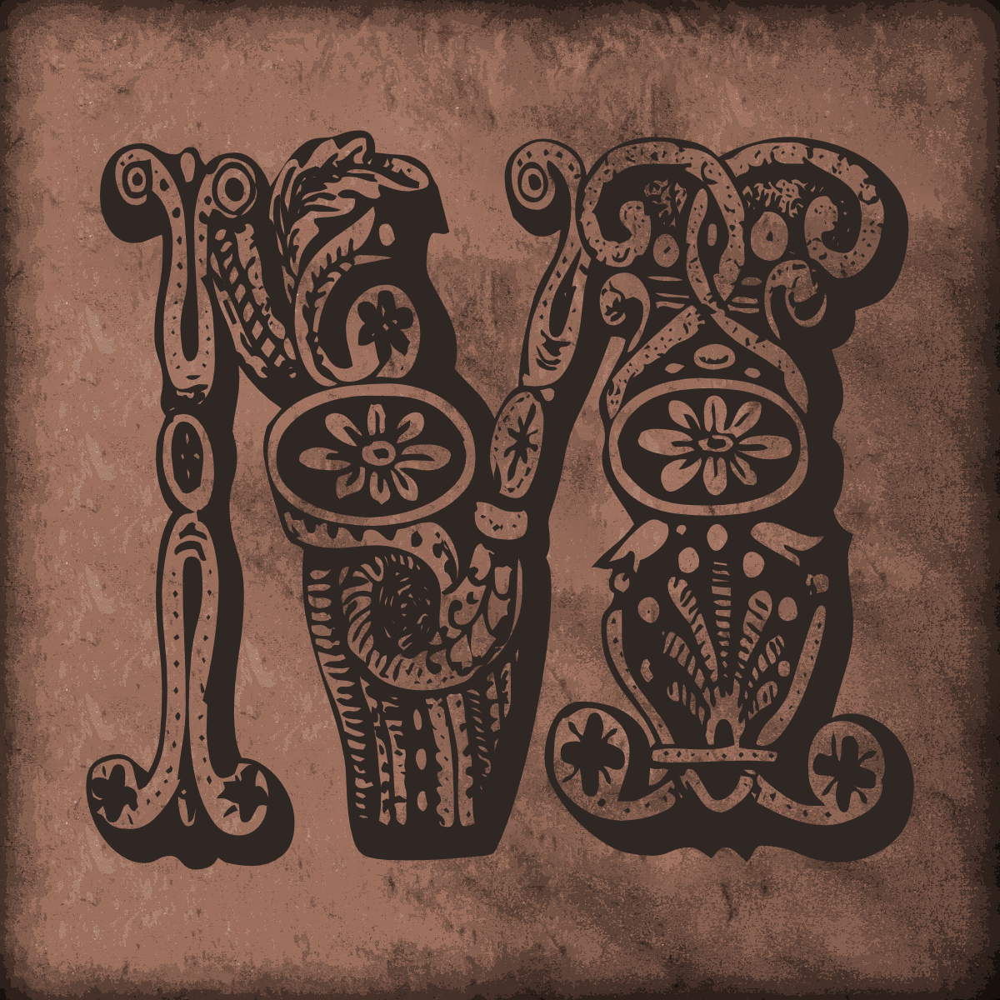
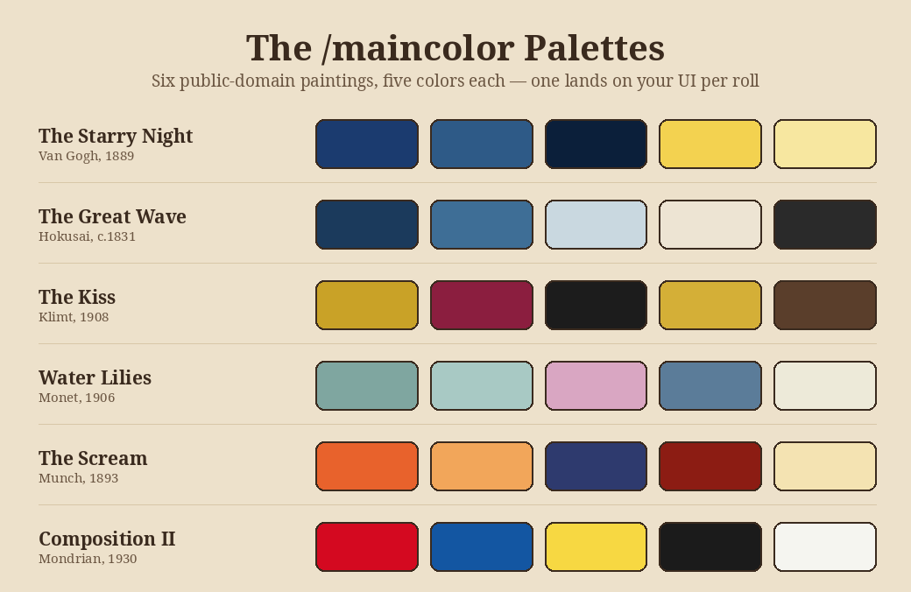

  

<h1 align="center">Maines</h1>

<em>Take your main name to the chat frame, then gtfo.</em>

  
  
  

Maines tags your outgoing chat messages with your "main" character's name wrapped in a bracket
style of your choice, so guildies/friends know who's really talking even when you're on an alt.

Compatible with modern retail WoW (Interface 12.1.0 — *Midnight*). Chat tagging was broken by
Midnight's rearchitecture of outgoing chat and has been fixed — see **Status** below.

## Installation

Grab the zip from the **[Releases page](https://github.com/tuniveza/Maines/releases/latest)**,
not the green "Code" button's Download ZIP — that one names the folder `Maines-main`, which
WoW won't recognize as a valid addon folder. The Releases zip is prebuilt so it extracts to a
folder already named `Maines`; just drag that straight into your `Interface/AddOns/` folder.

## Quick Start

1. `/mains Misamu (` — sets your main name to "Misamu" with `(` `)` brackets.
2. Send any chat message — it goes out as `(Misamu) <your message>`.
3. `/main` any time to double check what's currently configured.

That's the whole workflow. Everything below is for customizing it further.

## Slash Commands

### Setting your name and bracket style — `/mains`

`/mains` takes your main's name plus one or two symbols for the bracket, space-separated:

| Command | Result |
|---|---|
| `/mains Misamu (` | `(Misamu)` — recognized bracket symbol, auto-fills the matching right side |
| `/mains Misamu *` | `*Misamu*` — unrecognized symbol, used on both sides |
| `/mains Misamu << >>` | `<<Misamu>>` — two symbols given, used independently as left/right |

Recognized bracket symbols (see `/bracket` for the full list with names): `[` `(` `<` `{` `.` `:` `-` `~` `@` `#`.
Anything else you type (a custom symbol, or two symbols) is used as-is — you're not limited to the
built-in list.

Once set, the name/bracket persist across sessions (saved per character) until you `/mains` again.

### Checking your current setup — `/main`

Prints your currently saved main name, bracket type, and left/right symbols. Doesn't change anything.

### Playing your main vs. an alt — `/mainhide` and `/mainshow`

Maines compares your saved main name against whichever character you're actually logged into
(case-insensitive), and behaves differently depending on the result:

| Command | When you're **on your main** | When you're **on an alt** |
|---|---|---|
| `/mainhide` (default) | Tag is suppressed — no point tagging yourself as yourself | Tagged as normal |
| `/mainshow` | Always tagged, even on your main | Tagged as normal |

Either command prints which mode is now active. This only affects the "on your main" case —
Maines always tags on alts regardless of this setting, since that's the whole point of the addon.

### Opening the UI — `/maines`

Opens the Maines frame (also reachable via the minimap icon's left-click, see below). Press
`Escape` or click the close button to dismiss it.

### Controlling which channels get tagged — `/mainchat`

By default, Maines tags every channel it knows about (say, yell, party, raid, instance, guild,
officer, whisper, battle.net whisper, communities, channel, emote, raid warning, and the
leader-broadcast variants). Use `/mainchat` to narrow that down:

| Command | Effect |
|---|---|
| `/mainchat` (no arguments) | Clears the filter — back to tagging everything |
| `/mainchat SAY,GUILD,PARTY` | Sets the filter to these channels (comma-separated) |
| `/mainchat list` | Print the channels currently in the filter, and the current mode |
| `/mainchat +WHISPER` | Add a channel to the existing filter, without retyping the rest |
| `/mainchat -WHISPER` | Remove a channel from the existing filter |
| `/mainchat -SAY,-YELL` | `+`/`-` accept a comma-separated list too — several edits in one command |
| `/mainchat mode include` | (default) the filter is a whitelist — tag **only** the listed channels |
| `/mainchat mode exclude` | Flip it: tag **every** channel **except** the listed ones |
| `/mainchat mode` | Print which mode is currently active |
| `/mainchat sticky` | Toggle whether the filter survives a `/reload` (off by default — see below) |

Case and spacing don't matter — `say, guild` and `SAY,GUILD` behave identically; everything is
normalized before matching.

You can't mix `+`/`-` edits with plain channel names in the same command (e.g. `/mainchat
+WHISPER,PARTY` is rejected, not guessed at) — that ambiguity used to get silently resolved the
wrong way and could wipe your filter; see **Status** below.

**Filters don't persist by default.** A filter set during testing and forgotten about used to
silently keep excluding channels forever across every future session. Now, unless you run
`/mainchat sticky`, your filter resets to "tag everything" on your next `/reload` or login. You
can also clear it instantly at any time — sticky or not — by **middle-clicking the minimap icon**.

Valid channel names: `SAY`, `YELL`, `EMOTE`, `PARTY`, `PARTY_LEADER`, `RAID`, `RAID_LEADER`,
`RAID_WARNING`, `INSTANCE_CHAT`, `INSTANCE_CHAT_LEADER`, `GUILD`, `OFFICER`, `WHISPER`,
`BN_WHISPER`, `CHANNEL`, `COMMUNITIES_CHANNEL`, `VOICE_TEXT`, `AFK`, `DND`.

Example: if another addon already tags your whispers and you don't want Maines doubling up there,
run `/mainchat -WHISPER` (or, more robustly, `/mainchat mode exclude` then `/mainchat WHISPER` —
tags everything except whispers, and automatically covers any new channel type added later).

### Listing bracket styles — `/bracket`

Prints every built-in bracket symbol with its name (Square, Circle, Crocodile, ButterFly, Dot,
Double Dot, Line, Wave, Spiral, Hash Bracket) so you know what to pass to `/mains`.

### Recoloring the UI — `/maincolor`

Repaints every Maines UI texture (frames, buttons, minimap icon) with a random color pulled from
a random public-domain art palette — Van Gogh's *Starry Night*, Hokusai's *Great Wave*, Klimt's
*The Kiss*, Monet's *Water Lilies*, Munch's *The Scream*, or Mondrian's *Composition II*. Run it
again for a different color. Requires the UI to have been opened at least once (`/maines`) so the
textures exist to paint. You can also right-click the minimap icon to do the same thing.

  

### Minimap icon — `/mainmap`

Toggles the Maines minimap icon on/off (it's on by default). While it's shown:
- **Left-click** shows/hides the Maines UI (same as `/maines`)
- **Right-click** rolls a new `/maincolor` palette
- **Middle-click** resets the `/mainchat` filter instantly, regardless of sticky
- It spins slowly, purely for fun
- Drag it anywhere around the minimap ring

### Intro music — `/mainmusic`

The Maines intro jingle only plays the first time you open the UI each session. Run `/mainmusic`
to reset that, so it plays again next time you `/maines`.

### Version stamp — `/mainstamp`

Prints the current build stamp ("The Mosaic Stamp [ ▦ ]"). Maines uses stamps instead of
alpha/beta/release version numbers.

### In-game command reference — `/mainhelp`

Opens a movable, scrollable reference window (dressed in the same parchment art as the rest of
the addon) instead of spamming chat — a small illustrative graphic showing what a tagged message
looks like, then every command above grouped by category (Setting Up Your Main, On Your Main vs.
an Alt, Chat Channel Filtering, Cosmetic & Minimap, Utility) with an icon, a plain-English
description, and a worked example for each. Press `Escape`, or click the close button, to dismiss
it. Contextual notes are included where relevant (e.g. that `/mainchat -WHISPER` is handy if
another addon already tags your whispers).

Prefer plain chat instead (e.g. to copy/paste a command)? Run `/mainhelp text` for the original
chat-printed version.

### Debugging — `/maindebug`

Toggles verbose debug printing of every tagging decision as you type: detected chat type (plus
`clubId`/`streamId` when you're chatting in a community), your saved name/brackets, whether a
channel filter is active and whether it matched, and whether the message was already tagged. Turn
this on first if chat tagging ever appears to silently stop working — it'll show exactly which
check is failing instead of guessing. If you're troubleshooting a report about a specific
community, ask the reporter to run `/maindebug`, type in that community's chat, and share what
prints — the `clubId` line confirms whether Maines even recognized it as community chat.

## Notes

- If another addon already prefixes your whispers, use `/mainchat -WHISPER` to stop Maines from
  doubling up on that channel.
- Built on Ace3 (AceAddon-3.0 / AceHook-3.0) plus LibDataBroker-1.1 / LibDBIcon-1.0 for the
  minimap icon.

## Status

- **Chat tagging: fixed and confirmed working on retail 12.1.0.** Patch 12.0.0 rearchitected
  outgoing chat, which silently broke the old `SendChatMessage` hook (no errors, tag just never
  appeared). Maines now hooks the modern `EventRegistry` `"ChatFrame.OnEditBoxPreSendText"`
  callback and edits the chat edit box text directly before Blizzard reads it for sending, with
  a `ChatEdit_SendText` hook kept as a fallback for Classic clients.
- **Communities support:** `COMMUNITIES_CHANNEL`, `BN_WHISPER`, and the `*_LEADER` broadcast
  types are now tagged by default alongside the classic channel list.
- **Multiple communities fix:** users in more than one community reported the tag only working
  for some of them. Blizzard doesn't reliably stamp the editbox's chat type as
  `COMMUNITIES_CHANNEL` for every community you belong to — it can silently fall back to `SAY`,
  which then gets filtered out by anyone running an explicit `/mainchat` list. Every club-chat
  editbox does always carry a `clubId` though, so Maines now normalizes the chat type using that
  instead, which works no matter how many communities you're in.
- **On-main detection:** Maines now knows whether you're playing the character set as your main
  and, by default, skips tagging in that case — see `/mainhide` / `/mainshow` above to change it.
- **`/mainhelp` is now a window, not a chat dump:** a movable, scrollable panel with an icon per
  command and an illustrative example graphic, built from the same data as the chat version
  (still available via `/mainhelp text`), rendered on a seamless parchment-tile background so it
  matches the rest of the addon's art instead of a flat dark box.
- **The minimap icon now toggles the window** on left-click instead of only ever opening it.
- **`/mainchat` filtering was silently broken:** comma-separated entries were never trimmed or
  case-normalized, so `SAY, GUILD` (a space after the comma) produced a filter entry `" GUILD"`
  that could never match the real chat type again — anything past the first channel in a list
  silently stopped working. A mistyped `+whisper` (lowercase) was worse: it fell through to the
  full-reset branch and replaced your entire filter with one bogus, unmatchable entry, silently
  disabling all tagging. Everything is now uppercased and trimmed before matching, so case and
  stray whitespace no longer matter.
- **Fixed a total load failure ("nothing works, every command is unknown"):** a stray
  `math.randomseed(time())` — added purely so `/maincolor` felt less repetitive across sessions —
  ran immediately at file load rather than inside a function. `time()` isn't available as a
  global in this client, so it threw right there, and Lua aborts the rest of the file on an
  unhandled error — meaning no frames were ever created and no slash command ever got registered.
  Confirmed by actually executing `maines.lua` against a stub WoW environment (not just
  syntax-checking it) with `time` left undefined, which reproduced the exact crash, and again
  after removing the call, which then loaded clean. Removed outright, then permanently
  reintroduced using `GetTime()` (a core, always-available WoW timer API) wrapped in `pcall()`,
  so even a future bad assumption here can't take the whole addon down again.
- **`/mainchat` filters no longer persist by default:** a filter set once and forgotten about
  used to silently keep excluding channels forever. It now resets to "tag everything" on every
  fresh load unless you explicitly run `/mainchat sticky`. Middle-clicking the minimap icon also
  clears it instantly at any time.
- **`/mainchat` gained an include/exclude mode:** `/mainchat mode exclude` flips the filter into
  a blacklist (tag everything *except* the listed channels), for cases like "tag everything but
  whispers" without hand-listing every other channel type. `/mainchat mode include` (the default)
  is the original whitelist behavior.
- **`/mainchat -SAY,-YELL` could silently wipe the whole filter:** reported by a real user, not
  just internal testing. The `+CHANNEL`/`-CHANNEL` pattern only ever matched one operation at a
  time; a comma-separated pair of them fell through to the "replace the whole filter" branch and
  got stored as the literal strings `"-SAY"`/`"-YELL"` (hyphens included), which could never
  match a real chat type — silently disabling all tagging, not just SAY/YELL. `+CHANNEL`/
  `-CHANNEL` now accept a comma-separated list of edits in one command, and mixing that style
  with a plain channel-name list in the same command is rejected outright with a clear error
  instead of silently falling through to whichever branch mishandles it.
- **Still needed:** an aesthetic/GUI rework — the frames, brackets, and textures are still the
  original placeholder art and haven't been touched (though `/maincolor` at least makes them
  more colorful in the meantime).

## Author

Dominic Hughes / Misamu — EU, Silvermoon (Alliance)
